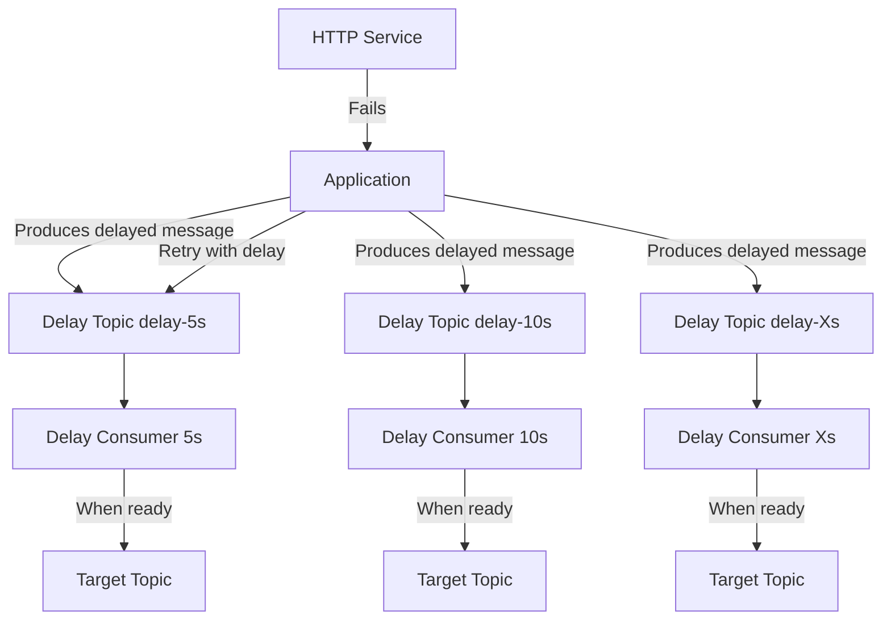

# Design Document

## Overview

The Kafka Delayed Messaging system implements a delay queue mechanism using separate Kafka topics for different delay durations. The system consists of producers that send messages to delay topics with processing timestamps in headers, and delay consumers that process these messages and forward them to target topics when ready.

## Architecture

The system follows a distributed architecture with the following components:



### Key Design Principles

1. **Topic Segregation**: Each delay duration has its own topic (e.g., delay-5s, delay-10s)
2. **Header-Based Metadata**: All delay information stored in Kafka message headers
3. **Stateless Processing**: No persistent state required, all timing based on message headers
4. **Scalable Consumers**: Multiple consumer instances can process the same delay topic

## Components and Interfaces

### 1. Delayed Message Producer

**Purpose**: Produces messages to appropriate delay topics with timing metadata

**Interface**:
```csharp
public interface IDelayedMessageProducer
{
    Task ProduceDelayedMessageAsync<T>(
        string targetTopic, 
        T message, 
        DelayDuration delayDuration, 
        CancellationToken cancellationToken = default);
    
    Task ProduceDelayedMessageAsync<T>(
        string targetTopic, 
        T message, 
        DateTime processAt, 
        CancellationToken cancellationToken = default);
}
```

**Key Responsibilities**:
- Select appropriate delay topic based on DelayDuration enum value
- Set message headers with target topic and processing timestamp
- Serialize message payload to JSON
- Handle producer errors and logging

### 2. Delay Consumer

**Purpose**: Consumes messages from delay topics and forwards them when ready

**Interface**:
```csharp
public interface IDelayConsumer
{
    Task StartAsync(DelayDuration delayDuration, CancellationToken cancellationToken);
    Task StopAsync();
}
```

**Key Responsibilities**:
- Consume messages from assigned delay topic
- Parse processing timestamp from headers
- Sleep until message is ready for processing
- Forward message to target topic
- Handle consumer errors and logging

### 3. Message Headers

**Standard Headers**:
- `x-target-topic`: Target topic name where message should be delivered
- `x-process-at`: Unix timestamp (milliseconds) when message should be processed
- `x-original-timestamp`: Original message timestamp for tracking

### 4. Delay Duration Enum

**Predefined Delay Durations**:
```csharp
public enum DelayDuration
{
    Seconds5 = 5,
    Seconds10 = 10,
    Seconds20 = 20,
    Seconds40 = 40,
    Minutes1 = 80,        // ~1.3 minutes
    Minutes3 = 160,       // ~2.7 minutes
    Minutes5 = 320,       // ~5.3 minutes
    Minutes11 = 640,      // ~10.7 minutes
    Minutes21 = 1280,     // ~21.3 minutes
    Minutes43 = 2560,     // ~42.7 minutes
    Hours1 = 5120,        // ~1.4 hours
    Hours3 = 10240,       // ~2.8 hours
    Hours6 = 20480,       // ~5.7 hours
    Hours11 = 40960,      // ~11.4 hours
    Hours23 = 81920,      // ~22.8 hours
    Days2 = 163840,       // ~1.9 days
    Days4 = 327680,       // ~3.8 days
    Days5 = 432000        // 5 days exactly
}
```

### 5. Configuration

**Kafka Configuration**:
```csharp
public class KafkaDelayConfig
{
    public string BootstrapServers { get; set; }
    public string DelayTopicPrefix { get; set; } = "delay-";
    public int MaxPollIntervalMs { get; set; } = 300000;
    public int SessionTimeoutMs { get; set; } = 30000;
    public string ConsumerGroupId { get; set; }
}
```

## Data Models

### 1. Delayed Message Envelope

```csharp
public class DelayedMessage<T>
{
    public T Payload { get; set; }
    public string TargetTopic { get; set; }
    public DateTime ProcessAt { get; set; }
    public DateTime CreatedAt { get; set; }
}
```

### 2. Message Headers Model

```csharp
public static class DelayHeaders
{
    public const string TargetTopic = "x-target-topic";
    public const string ProcessAt = "x-process-at";
    public const string OriginalTimestamp = "x-original-timestamp";
}
```

## Error Handling

### 1. Producer Error Handling

- **Serialization Errors**: Log error and throw exception to caller
- **Kafka Connection Errors**: Retry with exponential backoff, then fail
- **Invalid Delay Duration**: Validate and throw ArgumentException

### 2. Consumer Error Handling

- **Malformed Headers**: Log error and skip message (commit offset)
- **Target Topic Unreachable**: Log error, continue processing other messages
- **Deserialization Errors**: Log error and skip message
- **Processing Errors**: Log error and continue (fail-fast approach)

### 3. Logging Strategy

```csharp
public static class LogEvents
{
    public static readonly EventId MessageProduced = new(1001, "MessageProduced");
    public static readonly EventId MessageConsumed = new(1002, "MessageConsumed");
    public static readonly EventId MessageForwarded = new(1003, "MessageForwarded");
    public static readonly EventId ProcessingError = new(2001, "ProcessingError");
    public static readonly EventId HeaderMalformed = new(2002, "HeaderMalformed");
}
```

## Testing Strategy

### 1. Unit Tests

- **Producer Tests**: Verify correct topic selection, header setting, serialization
- **Consumer Tests**: Test message processing logic, timing calculations, error handling
- **Configuration Tests**: Validate configuration parsing and validation

### 2. Integration Tests

- **End-to-End Flow**: Produce delayed message, verify delivery to target topic
- **Multiple Delay Topics**: Test different delay durations work correctly
- **Error Scenarios**: Test malformed headers, unreachable topics
- **Scalability**: Test multiple consumer instances processing same delay topic

### 3. Performance Tests

- **Throughput**: Measure messages per second for different delay durations
- **Latency**: Verify millisecond precision in message delivery timing
- **Memory Usage**: Monitor consumer memory usage during long delays

### 4. Test Data Strategy

- Use TestContainers for Kafka integration tests
- Mock HTTP services for retry scenario testing
- Generate test messages with various delay patterns

## Implementation Notes

### 1. Timing Precision

- Use `DateTimeOffset.UtcNow.ToUnixTimeMilliseconds()` for consistent timestamps
- Sleep calculations should account for processing time overhead
- Consider using `Task.Delay()` with CancellationToken for interruptible sleeps

### 2. Consumer Group Strategy

- Each delay topic should have its own consumer group
- Consumer group naming: `{ConsumerGroupId}-{DelayTopic}`
- Enable auto-commit for processed messages

### 3. Topic Management

- Topics should be created externally (not by the application)
- Use appropriate partition count for scalability
- Consider retention policies for delay topics

### 4. Scalability Considerations

- Consumers can be scaled horizontally per delay topic
- Partition assignment will distribute load automatically
- Monitor consumer lag for performance tuning

### 5. Packages Restrictions

- Do not use Moq or FluentAssertions
- Use Confluent.Kafka, System.Text.Json